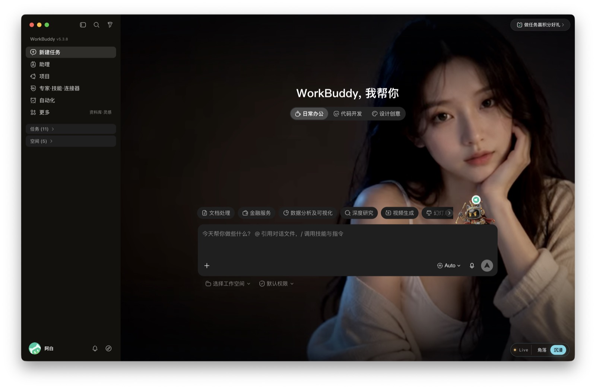
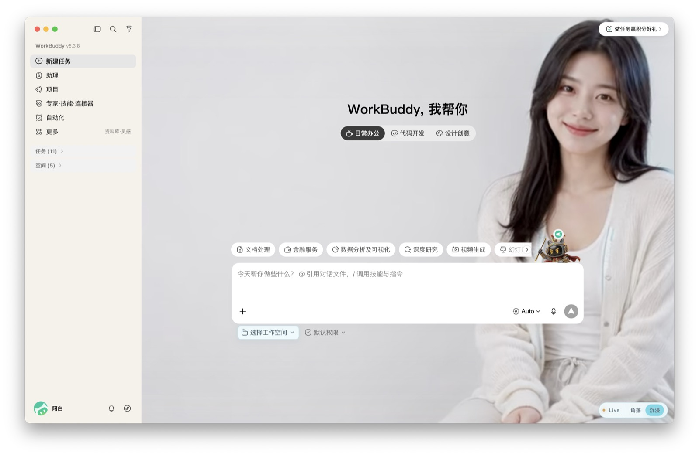
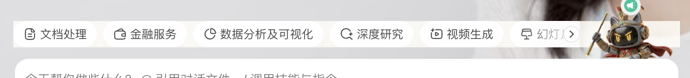

<div align="center">
  
  <h1>BuddyLiveGF</h1>
  <p>为 WorkBuddy 打造的动态角色皮肤控制器</p>
</div>

BuddyLiveGF 为 WorkBuddy 加入两套动态角色主题，并根据 WorkBuddy 的外观设置自动匹配：浅色外观使用暖白女友，深色外观使用深色赛博女友。

> 📌 **本 fork 说明**：上游公开发行仓库仅包含项目介绍、预览素材与 Release 安装包，**不含源代码**（macOS 版源码在编译好的 `.app` 中，未开源）。
> 本 fork 在 `windows/` 下新增了一份**开源、经过性能优化的 Windows 实现**（CDP 注入方案），与官方原理一致。

## 功能

- 暖白、深色两套动态角色主题
- 自动跟随 WorkBuddy 浅色／深色外观
- 角落与沉浸两种角色布局
- WorkBuddy 页面内即时切换布局
- 不修改 `WorkBuddy.app` / `WorkBuddy.exe` 安装包
- 本地回环连接，不提供网络服务

## 预览

### 深色主题



### 暖白主题



### 任务页面




## Windows 优化版（开源实现，位于 `windows/`）

`windows/` 下是一份独立重实现的 Windows 注入工具，原理与官方一致：
**通过 Electron 本地回环调试端口（CDP）注入脚本，不修改 WorkBuddy 安装包，仅连接 `127.0.0.1`。**

相比朴素实现，本版本做了如下性能优化：

| 朴素做法 | 本版优化 | 收益 |
|---|---|---|
| 主题变化就重写整段 `<style>` | 静态 CSS 只注入一次；切主题只翻 widget 的一个 class | 消除 CSS 整段重解析 |
| `getComputedStyle` + 解析 RGB 算亮度 | 读 `data-vscode-theme-kind` / `theme-dark` class（O(1)） | 零样式读取、零计算 |
| MutationObserver 每次突变都 `apply()` | rAF 合并 + 主题去重，没变就不动 DOM | 避免无意义重排/重绘 |
| 回调里改被观察的 `documentElement` | 回调只改 widget 自身 | 杜绝自触发死循环 |
| 每次都 `taskkill` 重启 | 端口已开则「热附连」 | 不中断用户会话 |
| 端口可能绑 `0.0.0.0` | 显式 `--remote-debugging-address=127.0.0.1` | 更安全、少占用 |
| 呼吸动画用 `width/height/top` | 仅 `transform`/`opacity`（合成线程） | 不触发 layout/paint |

此外启动器做了**幂等**处理：端口已开直接热附连（对应官方「热切换无需重启」），只有端口未开才带调试端口重启一次。

详见 [`windows/README.md`](windows/README.md)。

### 运行（Windows）

```bash
cd windows
npm install        # 仅需 ws 依赖
node launcher.js   # 首次会重启 WorkBuddy 并注入
```

终端命令：`corner` / `immersive`（切换布局）、`theme`（打印当前主题）、`exit`（退出）。
用 `WORKBUDDY_EXE` 环境变量可指定非标准安装路径的 `WorkBuddy.exe`。

## 下载与安装（macOS 官方版）

1. 打开上游 [Releases](../../releases) 页面。
2. 下载最新版 `BuddyLiveGF-*-macOS.zip`（Windows 版 `BuddyLiveGF-*-Windows*.zip` 亦自 v1.1.0 起提供）。
3. 解压后打开 `BuddyLiveGF.app` / `BuddyLiveGF.exe`。
4. 从 macOS 菜单栏选择"安装并应用 Live 皮肤"（Windows 版依其界面操作）。

首次打开如遇到系统安全提示，可参照官方说明放行（当前公开构建使用 ad-hoc 签名，尚未进行官方公证）。

## 系统要求

- macOS / Windows
- 官方 WorkBuddy 桌面版
- Node.js 20 或更高版本（仅 Windows 开源版需要，用于运行注入器）

## 说明

本仓库是 BuddyLiveGF 的公开发行仓库。上游原仓库仅包含项目介绍、预览素材和 Release 安装包，不包含项目源代码（macOS 版逻辑在编译好的 `.app` 中）。

`windows/` 目录下的实现为**原理一致的独立重实现 / 开源移植**，并非官方源码；其性能优化点见上表与 `windows/README.md`。

BuddyLiveGF 是独立的第三方外观工具，与 WorkBuddy 官方无隶属或授权关系。WorkBuddy 名称及相关商标归其权利人所有。
